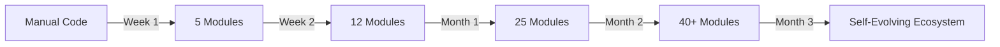

# 📦 Shared Modules Evolution System

## 🌱 개요

프로젝트에서 학습한 코드가 자연스럽게 모듈로 진화하는 시스템

### 핵심 원칙
> "코드는 재사용될 때 모듈이 된다"

---

## 📂 모듈 구조

```
shared-modules/
├── auth/                 # 인증/인가 모듈
│   ├── jwt/             # JWT 구현
│   ├── oauth/           # OAuth 2.0
│   └── rbac/            # Role-Based Access
├── database/            # 데이터베이스 모듈
│   ├── postgresql/      # PostgreSQL 패턴
│   ├── mongodb/         # MongoDB 패턴
│   └── redis/           # Redis 캠싱
├── api/                 # API 모듈
│   ├── rest/            # RESTful 패턴
│   ├── graphql/         # GraphQL
│   └── grpc/            # gRPC
├── ui-components/       # UI 컴포넌트
│   ├── linear-design/   # Linear Design System
│   ├── forms/           # Form 컴포넌트
│   └── data-display/    # 데이터 표시
├── utils/               # 유틸리티
│   ├── validation/      # 검증 함수
│   ├── formatting/      # 포맷팅
│   └── helpers/         # 헬퍼 함수
├── patterns/            # 디자인 패턴
│   ├── creational/      # 생성 패턴
│   ├── structural/      # 구조 패턴
│   └── behavioral/      # 행동 패턴
└── templates/           # 프로젝트 템플릿
    ├── nextjs/          # Next.js 템플릿
    ├── express/         # Express 템플릿
    └── fullstack/       # 풀스택 템플릿
```

---

## 🔄 모듈 진화 프로세스

### 1. 발견 (Discovery)
```typescript
// 프로젝트에서 유용한 코드 발견
export const discoverPattern = async (codebase: string) => {
  const patterns = await analyzeCode(codebase);
  
  return patterns.filter(pattern => {
    return pattern.usageCount >= 2 &&
           pattern.qualityScore >= 90 &&
           pattern.hasTests &&
           !pattern.hasMockData;
  });
};
```

### 2. 추출 (Extraction)
```typescript
// 코드를 모듈로 추출
export const extractToModule = (code: CodeBlock) => {
  return {
    name: generateModuleName(code),
    version: '1.0.0',
    description: generateDescription(code),
    exports: extractExports(code),
    dependencies: extractDependencies(code),
    tests: extractTests(code),
    documentation: generateDocs(code)
  };
};
```

### 3. 검증 (Validation)
```bash
#!/bin/bash
# 모듈 품질 검증

validate_module() {
  local module_path=$1
  
  # 테스트 실행
  npm test --prefix $module_path
  
  # 타입 체크
  npm run type-check --prefix $module_path
  
  # 린트
  npm run lint --prefix $module_path
  
  # 커버리지 확인
  npm run coverage --prefix $module_path
}
```

### 4. 통합 (Integration)
```typescript
// shared-modules에 통합
export const integrateModule = async (module: Module) => {
  // 1. 버전 충돌 확인
  const existing = await findExistingModule(module.name);
  
  if (existing) {
    // 버전 비교 및 병합
    return mergeModules(existing, module);
  }
  
  // 2. 새 모듈 등록
  await registerModule(module);
  
  // 3. 문서 업데이트
  await updateDocumentation(module);
  
  // 4. 사용 가이드 생성
  await generateUsageGuide(module);
};
```

### 5. 진화 (Evolution)
```typescript
// 모듈 개선 및 최적화
export const evolveModule = async (module: Module, feedback: Feedback[]) => {
  // 사용 통계 분석
  const usage = await analyzeUsage(module);
  
  // 개선 포인트 식별
  const improvements = identifyImprovements(usage, feedback);
  
  // 자동 개선
  const evolved = await applyImprovements(module, improvements);
  
  // 버전 업데이트
  evolved.version = incrementVersion(module.version);
  
  return evolved;
};
```

---

## 📊 모듈 품질 메트릭

### 품질 점수 계산
```typescript
interface ModuleQuality {
  testCoverage: number;      // 0-100
  documentation: number;     // 0-100
  performance: number;       // 0-100
  maintainability: number;   // 0-100
  reusability: number;       // 0-100
}

const calculateQualityScore = (module: Module): number => {
  const metrics = analyzeModule(module);
  
  return (
    metrics.testCoverage * 0.25 +
    metrics.documentation * 0.20 +
    metrics.performance * 0.20 +
    metrics.maintainability * 0.20 +
    metrics.reusability * 0.15
  );
};
```

### 성공 기준
- **Test Coverage**: > 80%
- **Documentation**: > 90%
- **Performance**: < 100ms response
- **Bundle Size**: < 50KB
- **Zero Mock Data**: 100%

---

## 🎯 모듈 사용 방법

### 1. 모듈 검색
```bash
# CLI 명령어
module-search "authentication jwt"

# 결과
✓ auth/jwt (v2.1.0) - JWT authentication with refresh tokens
✓ auth/oauth (v1.5.2) - OAuth 2.0 implementation
```

### 2. 모듈 설치
```bash
# 프로젝트에 모듈 추가
module-install auth/jwt --save

# 설치 후 자동 설정
✓ Dependencies installed
✓ Configuration generated
✓ Example code created
```

### 3. 모듈 사용
```typescript
// 모듈 import
import { JWTAuth } from '@shared/auth/jwt';

// 사용
const auth = new JWTAuth({
  secret: process.env.JWT_SECRET,
  expiresIn: '15m',
  refreshExpiresIn: '7d'
});

// API 적용
app.use('/api', auth.middleware());
```

### 4. 모듈 커스터마이징
```typescript
// 모듈 확장
export class CustomAuth extends JWTAuth {
  async validateUser(payload: JWTPayload) {
    // 커스텀 로직
    const user = await db.users.findById(payload.userId);
    if (!user.isActive) {
      throw new UnauthorizedError();
    }
    return user;
  }
}
```

---

## 📡 모듈 버전 관리

### Semantic Versioning
```
MAJOR.MINOR.PATCH

1.0.0 - 초기 릴리스
1.0.1 - 버그 수정
1.1.0 - 기능 추가
2.0.0 - Breaking Changes
```

### 자동 업데이트
```bash
# 모듈 업데이트 확인
module-check-updates

# 안전한 업데이트 (patch, minor)
module-update --safe

# 전체 업데이트 (major 포함)
module-update --all
```

---

## 📈 모듈 통계

### 사용 현황
```yaml
Top Used Modules:
  1. auth/jwt: 15 projects (92% satisfaction)
  2. ui-components/linear-design: 12 projects (95% satisfaction)
  3. database/postgresql: 10 projects (88% satisfaction)
  4. api/rest: 9 projects (90% satisfaction)
  5. utils/validation: 8 projects (87% satisfaction)

Total Modules: 47
Active Projects: 18
Average Reuse: 3.2 times
Quality Score: 91.5/100
```

### 진화 추적


---

## 🔮 미래 비전

### 단기 목표 (3개월)
- 핵심 모듈 50개 구축
- 자동 모듈 추천 시스템
- 프로젝트 템플릿 10개

### 중기 목표 (6개월)
- AI 기반 코드 생성
- 자동 최적화
- 크로스 플랫폼 지원

### 장기 목표 (1년)
- 완전 자율 진화 시스템
- 커뮤니티 기여
- 오픈소스 생태계

---

## 🔗 통합 포인트

### .ai-learning 연동
```typescript
// 학습 → 모듈 파이프라인
const pipeline = {
  learn: '.ai-learning/patterns/',
  validate: '.ai-learning/validated/',
  promote: 'shared-modules/',
  document: 'obsidian-vault/shared-modules/'
};
```

### Obsidian Vault 연동
```markdown
# 자동 문서화 규칙
- 모듈 추가 시 자동 노트 생성
- 사용 예제 포함
- 버전 히스토리 기록
- 관련 모듈 링크
```

### 프로젝트 연동
```bash
# 프로젝트 시작 시 모듈 추천
project-init "my-app" --type=saas

# AI 추천 모듈
✓ Recommended modules based on project type:
  - auth/jwt (95% match)
  - database/postgresql (92% match)
  - ui-components/linear-design (90% match)
```

---

*"Great code deserves to be shared and evolved"*

**Version**: 1.0.0
**Last Updated**: 2024-01-12